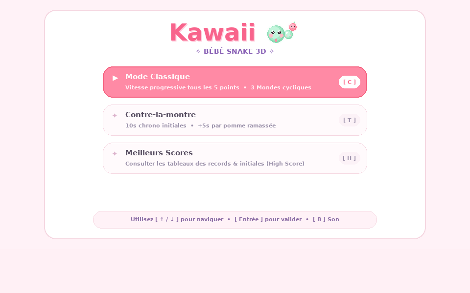
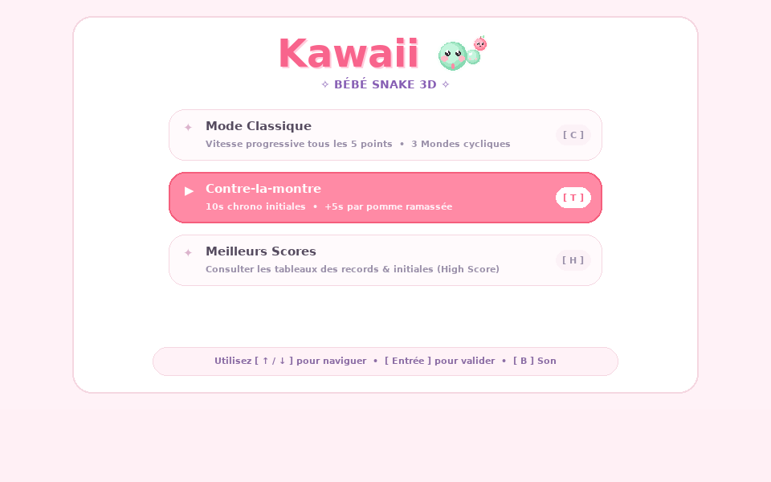
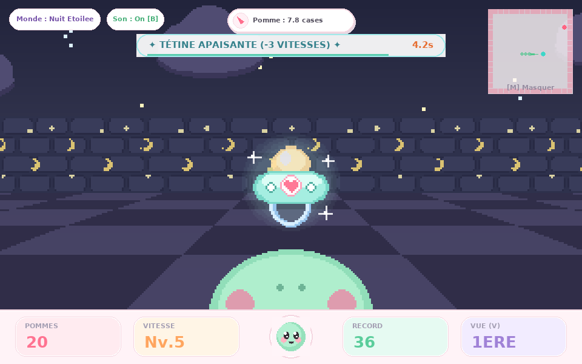
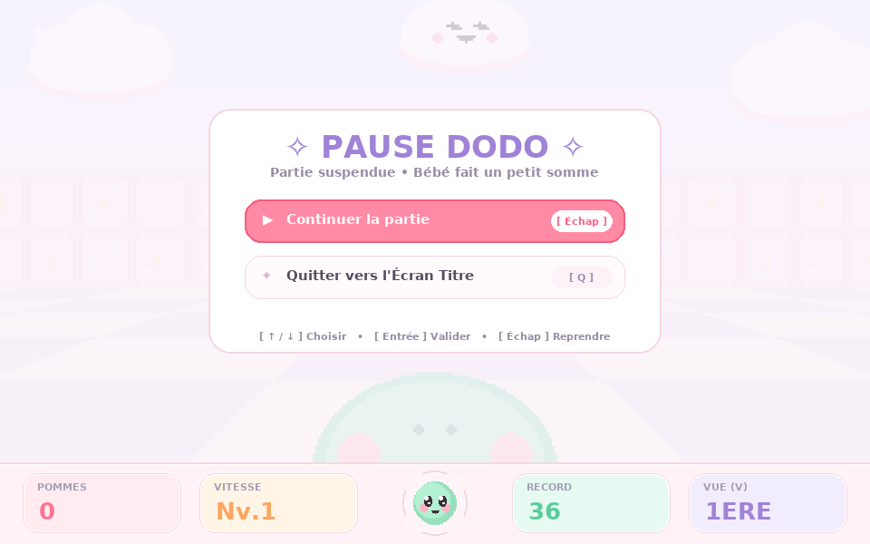
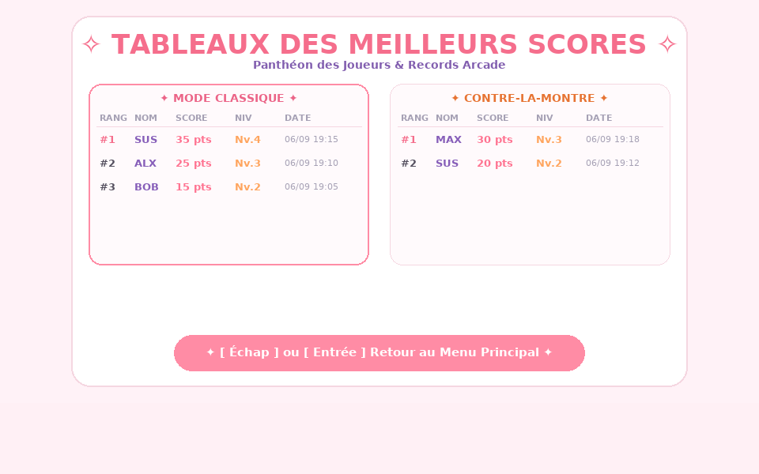
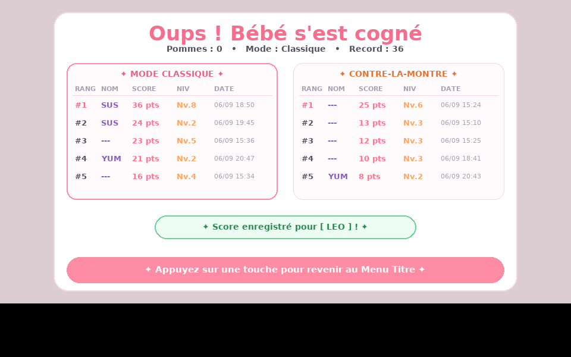

<div align="center">

# ✧ BÉBÉ SNAKE 3D KAWAII ✧

**Un jeu de Snake 3D rétro-kawaii propulsé par un moteur de raycasting temps réel sous Python & Pygame-ce !**

[](https://www.python.org/)
[](https://pyga.me/)
[](https://github.com/astral-sh/uv)
[](tests/)
[](LICENSE)

<br/>



<p align="center">
  <i>Une aventure tout en douceur pastel, avec des graphismes rétro inspirés des moteurs de raycasting des années 90, un serpent expressif aux grands yeux anime, des nuages flottants, des tétines apaisantes et des bruitages chiptune 100% synthétisés en Python !</i>
</p>

[✨ Fonctionnalités](#-fonctionnalités-phares) • [🚀 Guide d'installation pas à pas](#-guide-dinstallation-pas-à-pas) • [🎮 Comment Jouer](#-comment-jouer--règles-du-jeu) • [⌨️ Commandes](#-commandes--ergonomie) • [🍼 Bonus Tétine](#-le-bonus-tétine-apaisante) • [🛠️ Architecture](#️-architecture-technique)

</div>

---

## 🌸 Aperçu en Images

<div align="center">
  <table>
    <tr>
      <td align="center"><b>🎮 Écran Titre & Modes de Jeu</b></td>
      <td align="center"><b>⏱️ Mode Contre-la-Montre</b></td>
    </tr>
    <tr>
      <td></td>
      <td></td>
    </tr>
    <tr>
      <td align="center"><b>🍼 Bonus Tétine Apaisante</b></td>
      <td align="center"><b>💤 Pause Dodo Interactive</b></td>
    </tr>
    <tr>
      <td></td>
      <td></td>
    </tr>
    <tr>
      <td align="center"><b>🏆 Tableau des Meilleurs Scores</b></td>
      <td align="center"><b>💌 Saisie des Initiales (Fin de Partie)</b></td>
    </tr>
    <tr>
      <td></td>
      <td></td>
    </tr>
  </table>
</div>

---

## ✨ Fonctionnalités Phares

- **Moteur Raycasting Rétro 3D Pastel** :
  - Algorithme DDA (Digital Differential Analyzer) haute précision à 60 FPS constants.
  - Murs en bonbons guimauve rose poudré, cubes menthe douce et nuages pastel qui flottent dans le ciel.
  - Sol en damier chaud vanille & fraise avec brume vaporeuse marshmallow (adieu l'obscurité austère !).
  - 3 mondes cycliques qui évoluent au fil des niveaux : *Guimauve*, *Nuit Étoilée* et *Forêt Féerique*.
- **Deux Modes de Jeu Complets** :
  - 🌸 **Mode Classique** : Vitesse progressive tous les 5 points, survie infinie sans limite de temps.
  - ⏱️ **Mode Contre-la-montre** : 10 secondes au compteur au départ, chaque pomme rapporte +5 secondes. Alertes sonores et visuelles urgentes sous 5 secondes !
- **Double Vue Caméra Dynamique (Touche `V`)** :
  - **1ère Personne** : immersion totale avec le petit museau menthe de bébé serpent et sa langue rose en bas d'écran.
  - **3ème Personne (Chase Cam)** : vue panoramique derrière la tête avec traçage anti-collision contre les murs pour admirer tous les anneaux onduler.
- **🍼 Objet Bonus : La Tétine Apaisante** :
  - Apparaît aléatoirement pour 5 secondes avec un bandeau de compte à rebours et jauge douce.
  - Ralentit la vitesse du serpent de **1 palier** sans altérer le niveau ni le thème du joueur, et sans jamais descendre sous la vitesse de départ !
- **Tableau des Scores & Saisie d'Initiales Arcade** :
  - Système d'enregistrement arcade en 3 lettres (`ABC`) persistant dans un fichier JSON local.
  - Écran dédié de consultation des Meilleurs Scores avec colonnes Rang, Nom, Score, Niveau et Date.
  - Retour instantané au Menu Titre sur simple pression d'une touche ou clic souris après enregistrement.
- **Menu Pause Dodo Interactif (Touche `Échap` ou `P`)** :
  - Modal pastel suspendue avec options cliquables et navigables : *Continuer la partie* ou *Quitter vers l'Écran Titre*.
- **Audio Procédural Sans Fichiers Externes** :
  - Tous les effets sonores (croc de pomme, fanfare de niveau, alerte chrono, tétine, choc doux, clics de menu) sont synthétisés mathématiquement avec NumPy et le mixer audio de Pygame !

---

## 🚀 Guide d'Installation Pas à Pas

Vous pouvez lancer le jeu en moins de 30 secondes en choisissant la méthode de votre choix :

### Méthode 1 : Avec `uv` (Recommandé - Ultra rapide ⚡)

[`uv`](https://github.com/astral-sh/uv) est un gestionnaire d'environnement et de paquets Python ultra-rapide qui télécharge automatiquement la bonne version de Python et les dépendances sans polluer votre système.

#### 1. Installer Git et `uv` (si ce n'est pas déjà fait)
- **Linux / macOS** :
  ```bash
  curl -LsSf https://astral.sh/uv/install.sh | sh
  ```
- **Windows (PowerShell)** :
  ```powershell
  powershell -ExecutionPolicy ByPass -c "irm https://astral.sh/uv/install.ps1 | iex"
  ```

#### 2. Cloner le dépôt depuis GitHub
Ouvrez votre terminal et saisissez :
```bash
git clone https://github.com/iSushi42/snake-3d-kawaii.git
cd snake-3d-kawaii
```

#### 3. Lancer le jeu !
Une seule commande suffit (l'environnement virtuel et les dépendances sont configurés automatiquement) :
```bash
uv run kawaii-snake
```

---

### Méthode 2 : Avec GitHub Desktop

Si vous préférez une interface graphique :

1. Ouvrez **GitHub Desktop**.
2. Allez dans le menu **File** > **Clone Repository...** (ou `Ctrl + Shift + O`).
3. Dans l'onglet **URL**, collez l'adresse :
   ```
   https://github.com/iSushi42/snake-3d-kawaii.git
   ```
4. Choisissez le dossier de destination sur votre ordinateur et cliquez sur **Clone**.
5. Une fois le clonage terminé, cliquez sur **Repository** > **Open in Terminal** (ou `Ctrl + \``).
6. Dans la console qui s'ouvre, lancez simplement :
   ```bash
   uv run kawaii-snake
   ```

---

### Méthode 3 : Avec Python standard & `pip` (Sans `uv`)

Si vous disposez déjà de **Python 3.12 ou supérieur** installé :

```bash
# 1. Cloner le dépôt
git clone https://github.com/iSushi42/snake-3d-kawaii.git
cd snake-3d-kawaii

# 2. Créer et activer un environnement virtuel
python -m venv .venv
source .venv/bin/activate     # Sur Linux / macOS
# ou sur Windows : .venv\Scripts\activate

# 3. Installer les dépendances
pip install -e .

# 4. Lancer le jeu
kawaii-snake
# ou alternativement :
python -m snake.kawaii_main
```

---

## 🎮 Comment Jouer & Règles du Jeu

1. **Lancement & Choix du Mode** :
   - Au lancement, l'écran titre vous accueille avec le logo pastel **Kawaii** et la mascotte animée de bébé serpent.
   - Choisissez avec les touches `↑ / ↓` ou à la souris :
     - 🌸 **Mode Classique** : Le grand classique ! Chaque pomme mangée fait grandir le corps du serpent de 1 anneau. Tous les 5 points, la vitesse augmente d'un cran et le décor bascule dans un nouveau thème pastel !
     - ⏱️ **Contre-la-montre** : Vous commencez avec **10.0 secondes**. Chaque pomme vous offre **+5.0 secondes** de sursis (jusqu'à 60s max). Évitez le zéro !
     - 🏆 **High Score** : Consultez le tableau des 5 meilleurs records pour chaque mode de jeu.

2. **La Boussole Tactique (En haut de l'écran)** :
   - Une boussole pastel vous indique en temps réel où se trouve la pomme par rapport à votre orientation :
     - Flèche `▲` verte : *Droit devant !*
     - Flèches `◀` ou `▶` : Tournez à gauche ou à droite.
     - Distance exacte affichée en mètres/cases.

3. **Collision & Fin de partie** :
   - Toucher un mur de bonbons ou croiser son propre corps termine la partie avec un petit couinement mignon.
   - Entrez vos **3 initiales** avec le clavier (`Entrée` pour valider).
   - Une fois enregistré, **appuyez sur n'importe quelle touche** (ou clic souris) pour retourner directement au Menu Titre.

---

## ⌨️ Commandes & Ergonomie

Le jeu s'adapte automatiquement aux claviers **AZERTY** et **QWERTY** ainsi qu'aux flèches :

| Action | Touches Clavier | Souris / Raccourcis |
| :--- | :--- | :--- |
| **Virer à Gauche (90°)** | `Q` (AZERTY), `A` (QWERTY), `←` Flèche Gauche | - |
| **Virer à Droite (90°)** | `D`, `→` Flèche Droite | - |
| **Boost d'Accélération** | Maintenir `Z` (AZERTY), `W` (QWERTY) ou `↑` Flèche Haut | - |
| **Changer de Caméra** | `V` (1ère personne ↔ 3ème personne Chase Cam) | - |
| **Afficher / Masquer Radar** | `M` (Minimap avec position de la pomme & tétine) | - |
| **Menu Pause Dodo** | `Échap` ou `P` | Clic sur les boutons de pause |
| **Reprendre la Partie** | `Échap` ou `Entrée` ou `Espace` | Clic sur *Continuer la partie* |
| **Quitter vers le Titre** | `Q` (dans le menu pause) | Clic sur *Quitter vers l'Écran Titre* |
| **Activer / Couper le Son** | `B` (Bruit / Musique on/off) | - |
| **Navigation dans les Menus**| `↑ / ↓` ou `Z / S` (Valider avec `Entrée` / `Espace`) | Clic direct sur les cartes |

> [!TIP]
> **Corridor Snapping** : Lorsque vous tournez à 90°, le serpent s'aligne automatiquement au centre du couloir pour garantir que vous ne restiez jamais bloqué entre deux cellules de la grille !

---

## 🍼 Le Bonus Tétine Apaisante

Pour apporter de la variété et du répit dans les moments de vitesse intense :

- **Apparition Aléatoire** : Une adorable tétine pastel apparaît périodiquement dans l'arène.
- **Bandeau & Compte à Rebours** : Un bandeau cyan pastel s'affiche en haut de l'écran avec une jauge animée de **5.0 secondes**. Si la tétine n'est pas ramassée à temps, elle disparaît doucement !
- **Effet Apaisant** :
  - Ramasser la tétine réduit la vitesse de déplacement de **1 palier**.
  - **Respect de la progression** : Votre niveau actuel (`Nv. X`) et le thème graphique ne sont **jamais régressés** !
  - **Vitesse plancher sécurisée** : La vitesse ne descend jamais en dessous de la vitesse de démarrage initiale.

---

## 🛠️ Architecture Technique

Le projet est conçu de manière modulaire en Python pur, sans dépendances lourdes autres que `pygame-ce` et `numpy` :

```
snake-3d-kawaii/
├── pyproject.toml              # Configuration du projet & dépendances
├── uv.lock                     # Lockfile reproductible des dépendances
├── README.md                   # Présentation GitHub & guide pas à pas
├── docs/
│   ├── GUIDE_TECHNIQUE.md      # Documentation technique approfondie du moteur
│   └── images/                 # Captures d'écran et illustrations du jeu
├── src/
│   └── snake/
│       ├── __init__.py         # Package entrypoint
│       ├── kawaii_config.py    # Constantes, résolutions, thèmes & palettes pastel
│       ├── kawaii_game.py      # Logique de jeu, grille 16x16, tétine, leaderboard JSON
│       ├── kawaii_raycaster.py # Moteur de rendu raycasting DDA, damier & sprites 3D
│       ├── kawaii_textures.py  # Générateur procédural des textures & mascottes pixel-art
│       ├── kawaii_hud.py       # HUD pastel, boussole, radar, menus & écrans de mort/pause
│       ├── kawaii_audio.py     # Synthétiseur audio chiptune temps réel (ondes pures)
│       └── kawaii_main.py      # Boucle événementielle 60 FPS, gestion clavier/souris
└── tests/
    └── test_kawaii.py          # 34 tests unitaires validant 100% des mécaniques
```

---

## 🧪 Tests Automatisés

Le projet inclut une suite complète de **34 tests unitaires** vérifiant la physique, le raycasting, les collisions, le bonus tétine, le système de scores et les interfaces :

```bash
uv run pytest
```

---

## 📄 Licence & Auteur

- **Créateur** : [iSushi42](https://github.com/iSushi42)
- **Licence** : [MIT License](LICENSE) — Vous êtes libre de jouer, modifier et redistribuer ce projet !

<div align="center">
  <sub>Fait avec beaucoup d'amour pastel, de guimauve et de Python 🌸</sub>
</div>
